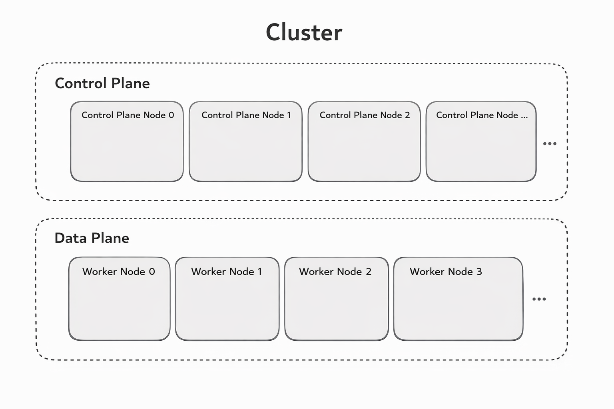
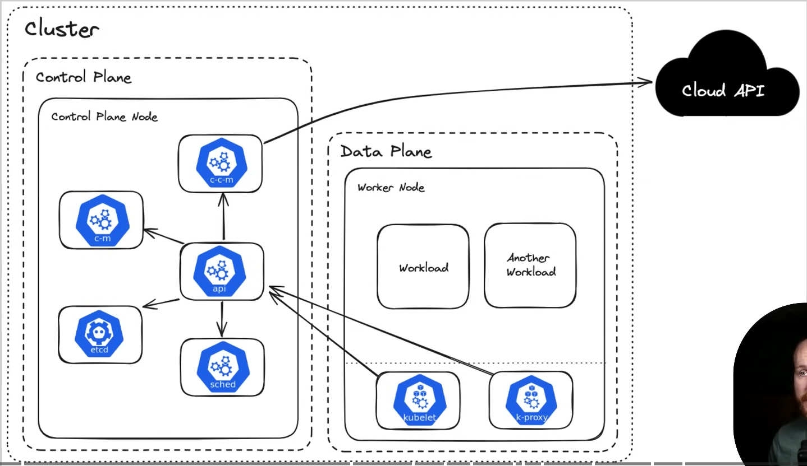
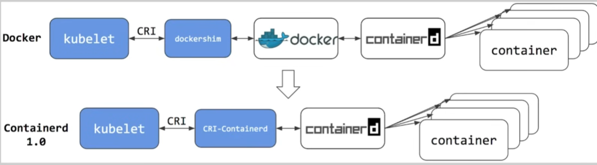

Kubernetes works very similar to a musical orchestra performance. In an orchestra, many musicians play different instruments together to create one coordinated piece of music. Each musician has a specific role, and all of them must work in perfect timing. However, they do not manage themselves individually. There is a conductor standing in front who ensures everyone plays correctly, maintains rhythm, replaces mistakes quickly, and adjusts based on the situation.

In the same way, Kubernetes manages multiple containers running an application. The containers are like musicians, and Kubernetes acts like the conductor. If one container (musician) stops working during a live performance, the conductor quickly adjusts to maintain the flow of music. Similarly, if a container crashes in a Kubernetes cluster, Kubernetes automatically restarts or replaces it without affecting users. This is called self-healing.

Now imagine the audience suddenly increases in number. In an orchestra, the conductor may instruct musicians to increase intensity to reach the entire audience. In Kubernetes, when user traffic increases, it automatically creates more pods (containers) to handle the load. When traffic decreases, it reduces the number of pods. This ensures efficient performance without wasting resources.

## ⭐ What is Kubernetes?

Kubernetes is an open-source container orchestration platform used to automate deployment, scaling, and management of containerized applications. It helps teams run applications reliably across multiple servers without manually managing each container.

It was originally developed by Google and is now maintained by the Cloud Native Computing Foundation.

In simple words, if Docker runs containers, Kubernetes manages containers at scale.

---

### ⚡ Why Kubernetes is Needed

When you run applications in containers (like Docker), problems arise:

* What if a container crashes?
* How do you scale from 2 containers to 200?
* How do containers talk to each other?
* How do you update an app without downtime?

Kubernetes solves these automatically.

---

## ⭐ What Kubernetes Does

Kubernetes provides:

* Automatic deployment of containers
* Auto-scaling (based on traffic/load)
* Self-healing (restarts failed containers)
* Load balancing between containers
* Rolling updates without downtime
* Secret and configuration management

---

## ⭐ Simple Real-World Example

Imagine you built a MERN stack app (like you are working on).

Without Kubernetes:

* You manually start containers
* If server crashes → app is down
* Scaling means manually creating more containers

With Kubernetes:

* It ensures required number of app instances are always running
* If one crashes → automatically restarts
* If traffic increases → auto-scales
* If traffic drops → scales down

---

## ⭐ Key Kubernetes Concepts (Basic Level)

| Concept    | Meaning                                      |
| ---------- | -------------------------------------------- |
| Pod        | Smallest unit in Kubernetes (runs container) |
| Node       | A server (VM or physical machine)            |
| Cluster    | Group of nodes                               |
| Deployment | Manages pods                                 |
| Service    | Exposes application to network               |
| Namespace  | Logical separation inside cluster            |

---

## ⭐ Architecture of Kubernetes 

## ⭐ Kubernetes Architecture (Based on the Image)

The image shows a complete Kubernetes cluster divided into two main parts: the **Control Plane** and the **Data Plane**. Together, these components form a Kubernetes cluster, which is simply a group of machines working together to run applications reliably.

At the top of the image, you see the **Cluster**, which is the full system. Inside the cluster, there are two clearly separated sections. The upper section is the Control Plane, and the lower section is the Data Plane.

---

## ⭐ Control Plane (The Brain of Kubernetes)

The Control Plane is responsible for making decisions and managing the entire cluster. In the image, you can see multiple Control Plane Nodes such as Control Plane Node 0, Node 1, and Node 2. This shows that even the brain of the system can run on multiple machines for high availability.

The Control Plane does not run your application directly. Instead, it:

* Decides where containers should run

* Monitors cluster health
* Restarts failed workloads
* Maintains the desired state
* Handles scaling and updates

You can think of the Control Plane as the “manager” of the system. It continuously checks whether the actual state matches the desired state defined by you.

For example, if you say, “I want 3 replicas of my backend,” the Control Plane ensures that exactly 3 are always running. If one fails, it creates another automatically.

---

## ⭐ Data Plane (Where Applications Actually Run)

The Data Plane, also called Worker Nodes, is where your real application runs. In the image, you see Worker Node 0, Worker Node 1, Worker Node 2, and Worker Node 3. These are the machines that actually execute containers.

Each Worker Node:

* Runs Pods (which contain containers)

* Communicates with the Control Plane
* Handles application traffic
* Reports status back to the Control Plane

If a Worker Node fails, the Control Plane detects the issue and reschedules the affected Pods onto another available Worker Node. This ensures high availability and reliability.

---

## ⭐ How Everything Works Together

When you deploy an application to Kubernetes:

1. You submit a configuration (YAML file).

2. The Control Plane reads your configuration.
3. It decides which Worker Node should run each Pod.
4. The Worker Nodes start the containers.
5. The Control Plane continuously monitors everything.

If something crashes in the Data Plane, the Control Plane immediately reacts and fixes it.

---

## ⭐ Kubernetes Architecture (Detailed – Based on This Image)

This image shows a more detailed view of Kubernetes architecture inside a cluster. The cluster is divided into two main sections: the Control Plane and the Data Plane. It also shows how Kubernetes communicates with the Cloud API.

At a high level, the Control Plane is responsible for managing the cluster, while the Data Plane is responsible for running the actual application workloads. The arrows in the diagram show how different components communicate with each other.

---

## ⭐ Control Plane (Cluster Management Layer)

Inside the Control Plane Node, you can see multiple core components:

The API Server (api) is the central entry point of the cluster. Every request, whether from kubectl, internal components, or cloud systems, goes through the API Server. It acts like the main gateway of Kubernetes. All components talk to each other through this API.

The etcd component is the key-value database of Kubernetes. It stores the entire cluster state, such as which pods are running, configurations, secrets, and desired replicas. When you deploy something, the configuration is stored in etcd.

The Scheduler (sched) is responsible for deciding where a new Pod should run. When a new workload is created, the scheduler checks available worker nodes and selects the best one based on resources like CPU and memory.

The Controller Manager (c-m) continuously monitors the cluster state. It ensures that the desired state matches the actual state. For example, if you say you want 3 replicas and one crashes, the controller creates a new one automatically.

The Cloud Controller Manager (c-c-m) connects Kubernetes to the Cloud API. If you are running Kubernetes in a cloud environment like AWS, Azure, or GCP, this component interacts with cloud services for load balancers, storage, and networking.

All these components work together, but the API Server acts as the communication hub between them.

---

## ⭐ Data Plane (Where Applications Run)

The Data Plane contains Worker Nodes. Inside each Worker Node, you see:

Workloads – These represent Pods running your actual application containers, such as frontend, backend, or database.

Kubelet – This is the agent running on every worker node. It communicates with the API Server and ensures that containers described in Pod specs are running properly.

Kube-proxy – This handles networking. It manages routing rules so that traffic can reach the correct Pod. It enables service discovery and internal load balancing.

In simple terms, the Worker Node executes the work, while continuously reporting back to the Control Plane.

---

## ⭐ How Everything Connects

When you deploy an application:

First, you send a request using kubectl.
The request goes to the API Server.
The API Server stores the configuration in etcd.
The Scheduler chooses a Worker Node.
The Kubelet on that Worker Node starts the containers.
Kube-proxy ensures network traffic reaches the correct Pod.

If something fails, the Controller Manager detects the issue and instructs the system to correct it.

If running in cloud, the Cloud Controller Manager talks to the Cloud API to create load balancers or storage volumes.

---

## ⭐ Kubernetes Control Plane Components (ccm, cm, api, sched, etcd)

This image shows the internal brain components of Kubernetes inside the Control Plane and how they interact with Worker Nodes. Let’s clearly understand each component in simple language.

---

### ⚡ API Server (api)

The API Server is the main entry point of Kubernetes. Every command you run using `kubectl`, every internal communication, and every component interaction goes through the API Server. It validates requests, processes them, and updates the cluster state. All other components talk to each other through the API Server, making it the communication hub of the entire cluster.

---

### ⚡ etcd

etcd is the database of Kubernetes. It stores the entire cluster’s configuration and current state as key-value pairs. Information like running pods, deployments, secrets, and node details are all stored inside etcd. When you apply a YAML file, the desired state is saved in etcd, and other components read from it to maintain consistency. If etcd fails, Kubernetes loses knowledge of the cluster’s state.

---

### ⚡ Scheduler (sched)

The Scheduler is responsible for deciding where a new Pod should run. When a Pod is created, it first stays in a pending state. The Scheduler checks available Worker Nodes and selects the best one based on resources like CPU and memory. After selecting the node, it informs the API Server, and the Pod gets assigned to that specific Worker Node.

---

### ⚡ Controller Manager (cm)

The Controller Manager ensures that the cluster’s actual state matches the desired state. If you specify that three replicas should run but only two are active, it automatically creates one more. If a node fails or a Pod crashes, it detects the issue and corrects it. It continuously watches the system and makes adjustments to maintain stability.

---

### ⚡ Cloud Controller Manager (ccm)

The Cloud Controller Manager connects Kubernetes to cloud providers. It communicates with the cloud platform’s API to create load balancers, attach storage volumes, manage networking, and handle node lifecycle events. When you create a LoadBalancer service, this component interacts with the cloud provider to provision the required infrastructure automatically.

### ⚡ kubectl

kubectl is the command-line tool used to interact with a Kubernetes cluster. It is not part of the cluster itself. Instead, it is installed on your local machine or admin server. Whenever you run commands like kubectl apply, kubectl get pods, or kubectl delete, the request is sent to the API Server inside the Control Plane.

kubectl does not directly create pods or manage containers. It simply sends instructions to the API Server. The API Server then updates etcd, and the other Control Plane components take action accordingly.

In simple terms, kubectl is your remote control to manage Kubernetes.

### ⚡ kube-proxy

kube-proxy runs inside every Worker Node. It is responsible for handling network communication between services and pods inside the cluster. When you create a Service, kube-proxy sets up networking rules so that traffic is routed to the correct Pod.

---

## ⭐ Kubernetes Standard Interfaces (CRI, CNI, CSI)

Kubernetes is designed as a modular system. Instead of tightly coupling container runtime, networking, and storage into the core system, it defines standard interfaces. These interfaces allow external components to integrate cleanly with Kubernetes. This design makes the platform flexible, extensible, and vendor-neutral.

---

### ⚡ Container Runtime Interface (CRI)

The Container Runtime Interface allows Kubernetes to communicate with container runtimes. Kubernetes itself does not run containers directly; it depends on a runtime such as containerd or CRI-O. Through CRI, Kubernetes sends instructions like creating, starting, or stopping containers.

Because of this interface, Kubernetes is not locked to a single container runtime. Any runtime that implements CRI can work with Kubernetes. This keeps the system flexible and allows runtime innovation without modifying Kubernetes core components.

---

### ⚡ Container Network Interface (CNI)

The Container Network Interface enables Kubernetes to manage networking through external plugins. Networking in Kubernetes is not hardcoded into the core system. Instead, Kubernetes relies on CNI-compatible plugins such as Calico, Flannel, or Cilium.

These plugins handle tasks like assigning IP addresses, enabling pod-to-pod communication, and managing network policies. Since they follow the CNI standard, they can be swapped or upgraded independently of Kubernetes itself.

---

### ⚡ Container Storage Interface (CSI)

The Container Storage Interface allows Kubernetes to integrate with different storage systems. When applications require persistent storage, Kubernetes communicates with external storage providers through CSI drivers.

These drivers manage operations such as attaching, detaching, mounting, and provisioning storage volumes. Whether the storage is from a cloud provider or an on-premise system, as long as it follows the CSI standard, it can work with Kubernetes.

---

By defining CRI, CNI, and CSI, Kubernetes separates responsibilities and allows runtime, networking, and storage innovations to evolve independently while still integrating seamlessly into the cluster.

## ⭐ Container Runtime Interface (CRI) – How Kubernetes Talks to Runtimes

Kubernetes does not run containers directly. The component responsible for running containers on each worker node is the kubelet, but kubelet itself does not create containers. Instead, it communicates with a container runtime using a standard called the Container Runtime Interface (CRI).

In the earlier setup, Kubernetes worked with Docker using something called dockershim. The flow was: kubelet → CRI → dockershim → Docker → containerd → containers. Dockershim acted as a translator because Docker was not originally built to follow CRI directly. This extra layer made the architecture more complex.

Later, Kubernetes removed dockershim and moved to a cleaner model. In the newer architecture, kubelet talks directly to a CRI-compatible runtime like containerd or CRI-O. The flow becomes: kubelet → CRI → container runtime → containers. This removes unnecessary layers and simplifies the system.

Containerd and CRI-O are examples of container runtimes that implement CRI natively. Because they follow the CRI standard, kubelet can communicate with them directly without needing a translation layer. This makes Kubernetes more modular and efficient.

The important idea here is that CRI acts as a standard communication contract. As long as a container runtime implements CRI, Kubernetes can use it. This gives flexibility to swap runtimes without redesigning the entire system.

## ⭐ Container Network Interface (CNI)

The Container Network Interface (CNI) defines how Kubernetes handles networking for Pods. Kubernetes itself does not implement detailed networking logic. Instead, it relies on CNI plugins to configure networking when Pods are created or deleted.

When a new Pod starts on a worker node, the kubelet calls the CNI plugin. The plugin assigns an IP address to the Pod, configures network routes, and ensures the Pod can communicate with other Pods inside the cluster. When the Pod is removed, the CNI plugin cleans up the network configuration.

Because Kubernetes follows the CNI standard, different networking solutions can be used depending on requirements.

Calico is a popular CNI plugin focused on networking and network security policies. It provides advanced features like fine-grained network policy control.

Flannel is a simpler CNI plugin mainly designed to enable basic Pod-to-Pod communication across nodes. It is lightweight and easy to set up.

Cilium is a more advanced networking solution that uses eBPF technology to provide high-performance networking, security, and observability.

In cloud environments, cloud-specific CNI plugins are often used. For example, Amazon VPC CNI integrates Pods directly with AWS VPC networking so that Pods receive IP addresses from the VPC. Azure CNI integrates with Azure Virtual Networks, and Google Cloud CNI integrates with Google Cloud networking infrastructure.

The key idea is that Kubernetes defines the networking contract through CNI, and different plugins implement that contract. This allows Kubernetes clusters to choose or switch networking solutions without changing the core Kubernetes system.

## ⭐ Container Storage Interface (CSI)

The Container Storage Interface (CSI) defines how Kubernetes connects to external storage systems. Kubernetes itself does not directly manage disks, cloud volumes, or storage devices. Instead, it uses CSI drivers to communicate with storage providers in a standardized way.

When a Pod requires persistent storage, Kubernetes creates a PersistentVolume and attaches it using a CSI driver. The CSI driver handles operations such as provisioning the volume, attaching it to a node, mounting it inside the container, and detaching it when the Pod is deleted.

Because CSI is a standard interface, different storage systems can integrate with Kubernetes without modifying Kubernetes core components.

---

### ⚡ Cloud-Specific CSI Drivers

Cloud providers offer their own CSI drivers to integrate their storage services directly into Kubernetes.

The Amazon EBS CSI Driver allows Kubernetes to provision and attach AWS Elastic Block Store volumes dynamically to Pods running in AWS.

The Compute Engine Persistent Disk CSI Driver enables Kubernetes clusters in Google Cloud to use persistent disks as storage volumes.

The Azure Disk CSI Driver integrates Azure managed disks with Kubernetes workloads running in Azure.

These drivers allow cloud storage to be dynamically created, attached, resized, and deleted directly through Kubernetes configurations.

---

### ⚡ Specialized CSI Drivers

Beyond cloud storage, CSI drivers also support other types of integrations.

The Cert Manager CSI Driver allows certificates to be mounted directly into Pods securely.

The Secrets Store CSI Driver enables external secret management systems (such as cloud secret managers) to inject secrets into Pods as mounted volumes.

---

CSI makes Kubernetes storage flexible and extensible. Instead of being limited to one storage backend, Kubernetes can integrate with multiple storage systems through standardized drivers, allowing persistent data management across different environments.

---

## ⭐ Key Concepts and Terminologies of Kubernetes

Kubernetes uses several core concepts to manage containerized applications efficiently. These terms represent the building blocks of how applications are deployed, scaled, and maintained inside a Kubernetes cluster.

---

### ⚡ Cluster

A cluster is the entire Kubernetes system that runs containerized applications. It consists of multiple machines working together. These machines are divided into Control Plane nodes, which manage the system, and Worker Nodes, which run the actual applications.

---

### ⚡ Node

A node is a machine inside the Kubernetes cluster. It can be a physical server or a virtual machine. Each node runs the necessary components required to execute containers and communicate with the control plane.

---

### ⚡ Pod

A pod is the smallest deployable unit in Kubernetes. It represents one or more containers that run together on the same node. Containers inside a pod share networking, storage, and resources.

---

### ⚡ Deployment

A deployment is a Kubernetes resource used to manage pods. It ensures that the specified number of pod replicas are running at all times. Deployments also allow rolling updates and rollbacks when updating applications.

---

### ⚡ Service

A service provides a stable network endpoint to access a group of pods. Since pods can start, stop, or move between nodes, services ensure consistent communication with them.

---

### ⚡ Namespace

A namespace is used to logically divide resources inside a Kubernetes cluster. It helps organize workloads and separate different environments like development, testing, and production.

---

### ⚡ ConfigMap

A ConfigMap is used to store configuration data separately from application code. Applications can read these configurations at runtime without rebuilding container images.

---

### ⚡ Secret

A secret stores sensitive information such as passwords, tokens, or API keys. Kubernetes manages these securely and allows applications to access them when needed.

---

### ⚡ Persistent Volume (PV)

A Persistent Volume represents a piece of storage in the cluster that exists independently of pods. It allows data to persist even if the pod using it is deleted.

---

### ⚡ Persistent Volume Claim (PVC)

A Persistent Volume Claim is a request for storage made by a pod. Kubernetes matches the request with an available Persistent Volume and attaches it to the pod.

---

These concepts form the foundation of Kubernetes and are essential for understanding how containerized applications are deployed, managed, and scaled in a cluster environment.

## ⭐ Kubernetes Alternatives

Kubernetes is the most popular container orchestration platform, but there are several alternatives that also manage containerized applications. These platforms provide similar features such as container deployment, scaling, networking, and service management, but they may be simpler or designed for specific use cases.

---

### ⚡ Docker Swarm

Docker Swarm is a container orchestration tool built directly into Docker. It allows multiple Docker hosts to work together as a single cluster. Docker Swarm is easier to set up and manage compared to Kubernetes, making it suitable for smaller environments or teams that want simple container orchestration.

---

### ⚡ Apache Mesos

Apache Mesos is a distributed systems kernel designed to manage large clusters of machines. It can run both containerized and non-containerized workloads. Mesos uses a framework called Marathon to manage containers and applications.

---

### ⚡ Nomad

Nomad is an orchestration platform developed by HashiCorp. It is known for being lightweight and easy to operate. Nomad can schedule containers, virtual machines, and standalone applications, making it flexible for different types of workloads.

---

### ⚡ OpenShift

OpenShift is an enterprise platform built on top of Kubernetes by Red Hat. It adds additional features such as developer tools, security controls, and integrated CI/CD pipelines for managing containerized applications in enterprise environments.

---

### ⚡ Amazon ECS

Amazon Elastic Container Service is a container orchestration service provided by Amazon Web Services. It allows users to run and manage containers in the AWS cloud without managing Kubernetes infrastructure.

---

These alternatives provide different approaches to container orchestration. Some focus on simplicity, while others focus on enterprise features or deep cloud integration. Kubernetes remains widely used because of its flexibility, large ecosystem, and strong community support.
