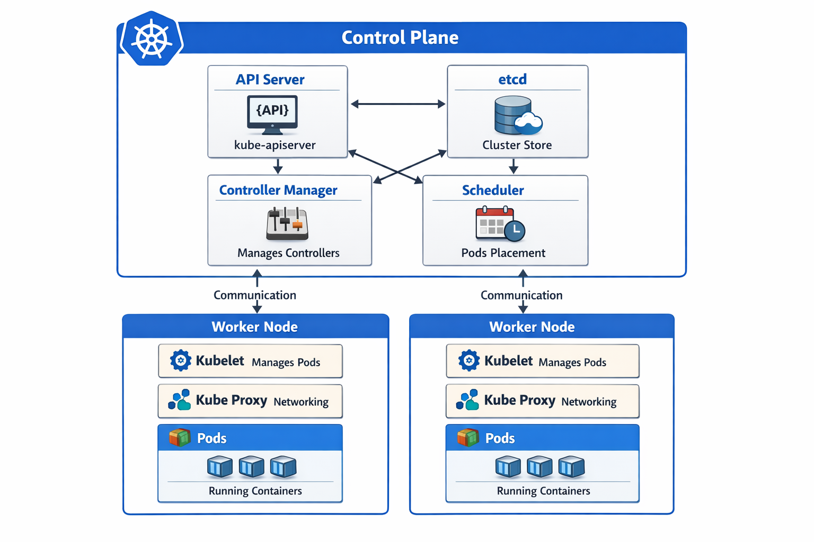
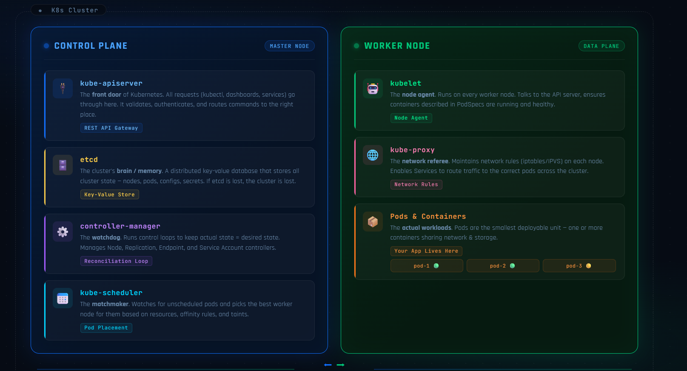

## ⭐ Cluster

A cluster in Kubernetes is a group of machines that work together to run and manage containerized applications. Instead of running an application on a single server, Kubernetes distributes workloads across multiple machines to improve reliability, scalability, and availability.

A Kubernetes cluster is made up of two main parts: the Control Plane and the Worker Nodes. The Control Plane manages the cluster and makes decisions about scheduling and maintaining applications. The Worker Nodes run the actual workloads, such as Pods and containers.

Using a cluster ensures that applications continue running even if one machine fails, because Kubernetes can automatically move workloads to other available nodes.

---

### ⚡ Key Characteristics of a Cluster

* A cluster consists of multiple machines working together
* It includes Control Plane nodes and Worker Nodes
* It provides high availability and fault tolerance
* It distributes workloads across multiple nodes
* It allows applications to scale easily

---

## ⭐ Node

A node is an individual machine inside a Kubernetes cluster. It can be either a physical server or a virtual machine. Nodes are responsible for running the actual containers that make up applications.

Each node contains components that allow it to communicate with the Control Plane and manage containers. These components ensure that the containers run properly and report their status back to the cluster.

Nodes provide the computing resources such as CPU, memory, and storage that applications need to run.

---

### ⚡ Key Characteristics of a Node

* A node is a worker machine in the cluster
* It runs Pods and containers
* It communicates with the Control Plane
* It provides CPU, memory, and storage resources
* Multiple nodes together form a cluster
## ⭐ Control Plane

The Control Plane is the central management layer of a Kubernetes cluster. It acts as the brain of the system and is responsible for controlling and managing the entire cluster. The Control Plane makes decisions about scheduling workloads, maintaining the desired state of the cluster, and responding to changes or failures.

Instead of running application containers directly, the Control Plane monitors the cluster and ensures that everything runs according to the configuration defined by the user. If something goes wrong, such as a pod crashing or a node becoming unavailable, the Control Plane detects the issue and takes corrective actions automatically.

The Control Plane communicates with all Worker Nodes and continuously checks whether the current state of the cluster matches the desired state defined in the configuration files.

---

### ⚡ Main Responsibilities of the Control Plane

* Managing the entire Kubernetes cluster
* Scheduling Pods to run on appropriate nodes
* Monitoring cluster health and status
* Maintaining the desired state of applications
* Handling scaling and updates of workloads

---

### ⚡ Major Components of the Control Plane

| Component                | Role                                                      |
| ------------------------ | --------------------------------------------------------- |
| API Server               | Entry point for all Kubernetes commands and communication |
| etcd                     | Database that stores cluster state and configuration      |
| Scheduler                | Decides which node should run a Pod                       |
| Controller Manager       | Ensures the cluster state matches the desired state       |
| Cloud Controller Manager | Integrates Kubernetes with cloud provider services        |

The Control Plane ensures that applications running in the cluster remain stable, scalable, and continuously available.

## ⭐ Kubernetes Control Plane Components

The Control Plane is responsible for managing the entire Kubernetes cluster. It contains several core components that work together to monitor the cluster, make scheduling decisions, and maintain the desired state of applications. The most important components are kube-apiserver, etcd, controller manager, and kube-scheduler.

---

### ⚡ kube-apiserver

The kube-apiserver is the main entry point of the Kubernetes control plane. All communication inside the cluster goes through the API server. When users run commands using `kubectl`, the request is sent to the API server, which validates the request and processes it.

It exposes the Kubernetes API that allows external tools, internal components, and users to interact with the cluster. The API server also reads and writes cluster information to the etcd database.

---

### ⚡ etcd

etcd is the distributed key-value database used by Kubernetes to store all cluster data. It keeps information about the cluster state, including pods, deployments, configurations, secrets, and node details.

Whenever a change occurs in the cluster, the updated state is stored in etcd. All control plane components rely on this data to understand the current and desired state of the system.

---

### ⚡ Controller Manager

The Controller Manager runs a collection of controllers that continuously monitor the cluster state. Its main responsibility is to ensure that the actual state of the cluster matches the desired state defined by the user.

For example, if a deployment requires three replicas of a pod and one pod fails, the controller manager automatically creates a new pod to maintain the required number of replicas.

---

### ⚡ kube-scheduler

The kube-scheduler is responsible for assigning newly created pods to worker nodes. When a pod is created, it initially stays in a pending state. The scheduler checks the available nodes and decides which node has enough resources such as CPU and memory.

After selecting the most suitable node, the scheduler assigns the pod to that node so it can start running.

## ⭐ kubelet

The kubelet is an agent that runs on every worker node in a Kubernetes cluster. Its main responsibility is to ensure that the containers defined in Pod specifications are running properly on that node. It acts as the communication bridge between the worker node and the Control Plane.

The kubelet continuously communicates with the kube-apiserver to receive instructions about which Pods should run on the node. Once it receives the Pod specification, it works with the container runtime to start and manage the containers inside the Pod.

If a container stops running or fails, the kubelet detects the issue and attempts to restart it according to the defined configuration. It also reports the health and status of the node and running Pods back to the Control Plane.

---

### ⚡ Responsibilities of kubelet

* Communicates with the kube-apiserver
* Receives Pod specifications from the Control Plane
* Starts and manages containers using the container runtime
* Monitors the health of Pods and containers
* Reports node and container status back to the Control Plane

## ⭐ kube-proxy

kube-proxy is a network component that runs on every worker node in a Kubernetes cluster. Its main role is to manage network communication between Pods and Services. It ensures that traffic sent to a Kubernetes Service is properly routed to the correct Pod running in the cluster.

In Kubernetes, Pods are dynamic and can be created or destroyed at any time. Because of this, their IP addresses can change frequently. kube-proxy solves this problem by maintaining network rules on each node so that requests sent to a Service are automatically forwarded to one of the available Pods that belong to that Service.

kube-proxy works by updating networking rules inside the node, usually using technologies like iptables or IPVS. These rules handle load balancing and ensure that requests are distributed across multiple Pods.

---

### ⚡ Responsibilities of kube-proxy

* Runs on every worker node
* Maintains network rules for Services
* Routes traffic from Services to Pods
* Performs basic load balancing between Pod replicas
* Ensures stable networking even when Pods change or restart

---

## ⭐ Worker Node (How Containers Are Created and Managed)

A Worker Node is the machine in a Kubernetes cluster where the actual containers run. The Control Plane decides what should happen in the cluster, and Worker Nodes execute those decisions by running containers. Several components work together to ensure the correct number of containers are always running.

---

### ⚡ API Server

The API Server is the central communication point of Kubernetes. Every component communicates through the API Server. When any component needs information or needs to perform an action, the request goes through the API Server.

The API Server also communicates with **etcd**, which stores the cluster information. Whenever the cluster needs to read or update data, the API Server interacts with etcd.

---

### ⚡ etcd

etcd is the database of Kubernetes. It stores the entire cluster information such as configuration, node details, and the desired state of applications.

The **desired state** means how many containers or Pods should be running. For example, if the configuration says **2 containers should run**, that information is stored in etcd. Control Plane components read this data to manage the cluster.

---

### ⚡ Controller Manager

The Controller Manager continuously checks whether the **desired state** and the **actual state** of the cluster match.

For example, if the desired state says **2 containers** should be running but the actual state shows only **1 container running**, the Controller Manager detects that one container is missing.

To know the desired state, the Controller Manager reads the information stored in etcd through the API Server. When it finds that a container is missing, it informs the API Server that another container needs to be created.

---

### ⚡ Scheduler

After the system knows that a new container needs to be created, the Scheduler decides where it should run.

If there are multiple Worker Nodes, the Scheduler checks the available resources on each node such as **CPU and RAM**. It calculates which node has enough resources and selects the most suitable one.

The Scheduler then informs the API Server about which Worker Node should run the container.

---

### ⚡ kubelet

The kubelet runs on every Worker Node and acts as the node agent. When the API Server sends instructions to create a container on a specific node, the kubelet receives that instruction.

The kubelet then communicates with the container runtime and tells it to create and start the container using the specified container image.

The kubelet also continuously monitors the containers running on that node. If a container crashes or stops working, the kubelet detects the failure and reports it back to the API Server.

---

### ⚡ Container Runtime

The container runtime is responsible for actually creating and running containers. When kubelet sends the instruction, the container runtime performs actions such as creating, running, stopping, or deleting containers.

Examples of container runtimes include **containerd** and **CRI-O**.

---

### ⚡ Self-Healing Process

If a container crashes on a Worker Node, the kubelet detects the failure and reports the status to the API Server.

The API Server informs the Controller Manager. The Controller Manager then compares the **desired state** stored in etcd with the **actual state** in the cluster. If it detects that one container is missing, it requests the API Server to create a new container.

The Scheduler selects the most suitable Worker Node based on available CPU and RAM. The API Server then sends the instruction to the kubelet on that node to create a container using the specified image.

The kubelet instructs the container runtime to create and start the container. This automatic detection and recreation of containers is called **self-healing**, ensuring that the application continues running even if a container fails.
