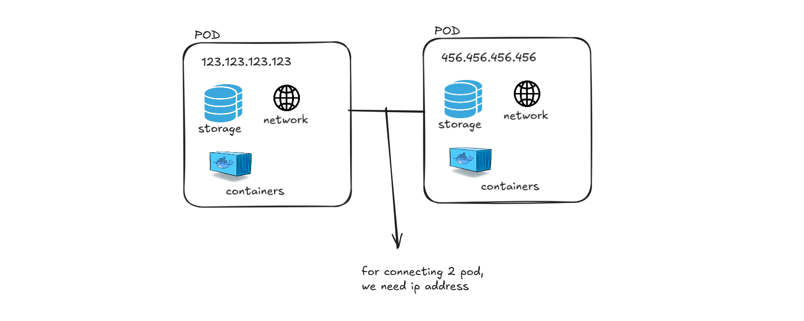

## ⭐ Pod

A Pod is the smallest deployable unit in Kubernetes. It represents a running instance of an application inside the cluster. A Pod can contain **one or more containers**, and these containers work together as a single unit.

Each Pod is assigned a **unique IP address** inside the Kubernetes cluster. This IP address allows the Pod to communicate with other Pods and services in the cluster.

Pods also have their own **network and storage environment**. The containers inside the Pod share this environment, which means they use the same network and storage resources.

---

### ⚡ Containers Inside a Pod

A Pod can contain multiple containers that are closely related and need to work together. Since these containers run inside the same Pod, they **share the same network and storage**.

Because they share the same network namespace, containers inside the Pod can communicate with each other using **localhost** instead of separate IP addresses. This means they do not need individual IP addresses to talk to each other.

For example, if a Pod has two containers:

* One container runs the main application
* Another container runs a logging service

Both containers can communicate internally using localhost because they share the same network.

---

### ⚡ Pod-to-Pod Communication

When two different Pods need to communicate with each other, they must use the **Pod IP address** because each Pod has its own unique IP.

For example:

* Pod A has IP `10.0.1.5`
* Pod B has IP `10.0.1.8`

If Pod A needs to communicate with Pod B, it must use Pod B’s IP address.

In Kubernetes, multiple Pods can be created to run multiple instances of the same application. Each Pod will have its own unique IP address, but the containers inside the same Pod will always share the same network and storage environment.



n practice, most applications run one container per Pod. This is because the Pod is treated as a single unit by Kubernetes. If the main container inside a Pod fails or crashes, Kubernetes usually recreates the entire Pod to bring it back to the desired state.

Because of this behavior, placing multiple unrelated containers in the same Pod is not common. If one container fails and the Pod needs to be recreated, all containers inside that Pod will be restarted together. For this reason, multiple containers in a Pod are usually used only when they are tightly related and must work together, such as sidecar containers for logging or monitoring.

### ⚡ When we need 2 container in a Pod?

This is why multiple containers in a Pod are typically used only when the applications are tightly integrated. For example, one container may run the main application while another container handles logging, monitoring, or proxy functionality that directly supports the main application. In this case, both containers are expected to run together, and if one fails, the overall application cannot function properly.


## ⭐ Creating a Pod Using YAML in Kubernetes

In Kubernetes, a Pod can be created using a YAML configuration file. This file describes the desired state of the Pod, such as the container image to run, the name of the Pod, labels, and the ports that should be exposed. Kubernetes reads this configuration and creates the Pod accordingly.

A typical Pod YAML file contains fields like **apiVersion**, **kind**, **metadata**, and **spec**. These fields define the structure and behavior of the Pod.

---

### ⚡ apiVersion

The **apiVersion** specifies which Kubernetes API version is used to create the resource. For Pods, the commonly used version is `v1`.

---

### ⚡ kind

The **kind** field specifies the type of Kubernetes resource you want to create. Since we are creating a Pod, the value will be `Pod`.

---

### ⚡ metadata

The **metadata** section contains information that identifies the Pod.

* **name** → The name of the Pod
* **labels** → Key-value pairs used for identifying and grouping resources

Labels are useful for selecting and managing Pods in services and deployments.

---

### ⚡ spec

The **spec** section defines the actual configuration of the Pod. It tells Kubernetes what containers should run inside the Pod and how they should run.

Inside spec, we define the containers.

---

### ⚡ containers

The **containers** field lists the containers that will run inside the Pod.

For each container, we specify:

* **name** → Name of the container
* **image** → Container image to run
* **ports** → Port exposed by the container

---

### ⚡ Example Pod YAML

```yaml
apiVersion: v1
kind: Pod
metadata:
  name: nginx-pod
  labels:
    app: web
spec:
  containers:
    - name: nginx-container
      image: nginx:latest
      ports:
        - containerPort: 80
```

```yml
apiVersion: v1
kind: Pod
metadata: 
  name: calc-pod
  labels: 
    project: calculator
spec: 
  containers: 
    - name: calc
      image: calc/calc-image
      ports: 
        - containerPort: 5173
``` 

In this example:

* `apiVersion` defines the Kubernetes API version
* `kind` specifies that the resource is a Pod
* `metadata` contains the Pod name and labels
* `spec` defines the container configuration
* The container runs the **nginx image** and exposes **port 80**

Once this YAML file is created, the Pod can be deployed using the command:

```
kubectl apply -f pod.yaml
```

Kubernetes will read the configuration and create the Pod with the specified container.

### ⚡ Get Kubernetes Pod

To get the list of all pods in the cluster, you can use the command:

```
kubectl get pods
```

```
NAME       READY   STATUS             RESTARTS   AGE
calc-pod   0/1     ImagePullBackOff   0          2m22s
```

```cmd
kubectl get pods -o wide
```

```cmd
NAME       READY   STATUS             RESTARTS   AGE     IP         NODE             NOMINATED NODE   READINESS GATES
calc-pod   0/1     ImagePullBackOff   0          2m52s   10.1.0.6   docker-desktop   <none>           <none>
```

### ⚡ Describe Kubernetes Pod

To get more information about a specific pod, you can use the command:

```
kubectl describe pod <pod-name>
```

```
kubectl describe pod calc-pod
```

```cmd
Name:             calc-pod
Namespace:        default
Priority:         0
Service Account:  default
Node:             docker-desktop/192.168.65.3
Start Time:       Thu, 05 Mar 2026 12:38:57 +0000
Labels:           project=calculator
Annotations:      <none>
Status:           Pending
IP:               10.1.0.6
IPs:
  IP:  10.1.0.6
Containers:
  calc:
    Container ID:
    Image:          calc/calc-image
    Image ID:
    Port:           5173/TCP
    Host Port:      0/TCP
    State:          Waiting
      Reason:       ImagePullBackOff
    Ready:          False
    Restart Count:  0
    Environment:    <none>
    Mounts:
      /var/run/secrets/kubernetes.io/serviceaccount from kube-api-access-mmv5b (ro)
Conditions:
  Type                        Status
  PodReadyToStartContainers   True
  Initialized                 True
  Ready                       False
  ContainersReady             False
  PodScheduled                True
Volumes:
  kube-api-access-mmv5b:
    Type:                    Projected (a volume that contains injected data from multiple sources)
    TokenExpirationSeconds:  3607
    ConfigMapName:           kube-root-ca.crt
    Optional:                false
    DownwardAPI:             true
QoS Class:                   BestEffort
Node-Selectors:              <none>
Tolerations:                 node.kubernetes.io/not-ready:NoExecute op=Exists for 300s
                             node.kubernetes.io/unreachable:NoExecute op=Exists for 300s
Events:
  Type     Reason     Age                  From               Message
  ----     ------     ----                 ----               -------
  Normal   Scheduled  4m16s                default-scheduler  Successfully assigned default/calc-pod to docker-desktop
  Normal   Pulling    70s (x5 over 4m16s)  kubelet            Pulling image "calc/calc-image"
  Warning  Failed     68s (x5 over 4m14s)  kubelet            Failed to pull image "calc/calc-image": Error response from daemon: pull access denied for calc/calc-image, repository does not exist or may require 'docker login'
  Warning  Failed     68s (x5 over 4m14s)  kubelet            Error: ErrImagePull
  Normal   BackOff    7s (x15 over 4m14s)  kubelet            Back-off pulling image "calc/calc-image"
  Warning  Failed     7s (x15 over 4m14s)  kubelet            Error: ImagePullBackOff
  ```   