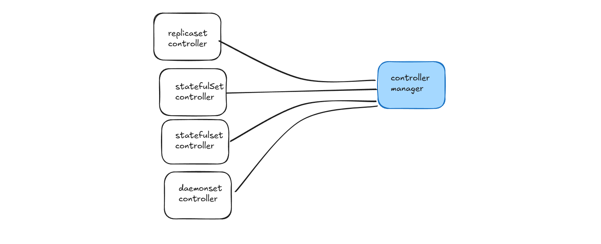

## ⭐ ReplicaSet

A ReplicaSet is a Kubernetes resource used to ensure that a specified number of identical Pods are running at all times in the cluster. Its main responsibility is to maintain the desired number of Pod replicas. If a Pod crashes or is deleted, the ReplicaSet automatically creates a new Pod to replace it.

ReplicaSet helps provide reliability and availability for applications by making sure the required number of Pods is always maintained.

---

### ⚡ How ReplicaSet Works

A ReplicaSet works by comparing the **desired state** and the **actual state** of Pods.

For example, if the desired state says **3 Pods should be running**, the ReplicaSet continuously checks the cluster. If one Pod fails or is deleted and only **2 Pods remain**, the ReplicaSet detects the difference and immediately creates a new Pod to bring the number back to **3**.

This ensures that applications remain available even when failures occur.

---

### ⚡ Pod Selection Using Labels

ReplicaSet uses **labels and selectors** to identify which Pods it manages.

Each Pod has labels, and the ReplicaSet uses a **selector** to match those labels. Only the Pods with matching labels will be managed by that ReplicaSet.

For example, if a ReplicaSet is configured to manage Pods with the label:

```
app: web
```

Then it will only monitor and control Pods that contain that label.

---

### ⚡ Important Note

In most real-world Kubernetes applications, developers do not create ReplicaSets directly. Instead, they create **Deployments**, and the Deployment automatically creates and manages the ReplicaSet.

The Deployment provides additional features such as **rolling updates, version control, and rollback**, which ReplicaSet alone does not handle.

---

## ⭐ ReplicaSet YAML File Structure

A ReplicaSet in Kubernetes is created using a YAML configuration file. This file defines how many Pods should run and what Pod template should be used to create them. The YAML file contains sections such as **apiVersion, kind, metadata, and spec**, which describe the configuration of the ReplicaSet.

---

### ⚡ apiVersion

The **apiVersion** specifies which Kubernetes API version is used to create the ReplicaSet. For ReplicaSets, the commonly used version is:

```
apiVersion: apps/v1
```

This tells Kubernetes that the resource belongs to the **apps API group**.

---

### ⚡ kind

The **kind** field defines the type of resource you want to create.

```
kind: ReplicaSet
```

This tells Kubernetes that the configuration will create a ReplicaSet.

---

### ⚡ metadata

The **metadata** section contains identifying information about the ReplicaSet.

Example fields include:

* **name** → Name of the ReplicaSet
* **labels** → Key-value pairs used to organize and identify resources

Example:

```
metadata:
  name: web-replicaset
  labels:
    app: web
```

Labels help Kubernetes group related resources together.

---

### ⚡ spec

The **spec** section defines how the ReplicaSet should behave.

---

### ⚡ replicas

The **replicas** field specifies how many Pods should run at the same time.

Example:

```
replicas: 3
```

This means Kubernetes will maintain **3 identical Pods**.

---

### ⚡ selector

The **selector** tells the ReplicaSet which Pods it should manage. It uses labels to identify them.

Example:

```
selector:
  matchLabels:
    project: kube-web
```

This means the ReplicaSet will manage Pods that contain the label **project: kube-web**.

---

### ⚡ template

The **template** defines the Pod configuration that the ReplicaSet will use to create Pods. It includes metadata and spec for the Pods.

---

### ⚡ template → metadata

Inside the template, metadata defines labels for the Pods. These labels must match the selector labels.

Example:

```
template:
  metadata:
    labels:
      project: kube-web
```

---

### ⚡ template → spec → containers

This section defines the containers that will run inside the Pod.

Example fields include:

* **name** → Name of the container
* **image** → Container image to run
* **ports** → Port exposed by the container

Example:

```
spec:
  containers:
    - name: kube-web-container
      image: nginx
      ports:
        - containerPort: 80
```

---

### ⚡ Example ReplicaSet YAML

```
apiVersion: apps/v1
kind: ReplicaSet
metadata:
  name: kube-web-rs
  labels:
    app: kube-web
spec:
  replicas: 3
  selector:
    matchLabels:
      project: kube-web
  template:
    metadata:
      labels:
        project: kube-web
    spec:
      containers:
        - name: kube-web-container
          image: nginx
          ports:
            - containerPort: 80
```

This configuration tells Kubernetes to create a ReplicaSet that maintains **3 Pods**, each running the **nginx container**, and manages Pods with the label **project: kube-web**.



## ⭐ How ReplicaSet Works (Inside Controller Manager)

In Kubernetes, the **ReplicaSet controller** runs inside the **Controller Manager**. Its main responsibility is to ensure that the number of running Pods always matches the desired state defined in the ReplicaSet YAML file.

When a ReplicaSet is created, Kubernetes reads the **replicaset.yml** configuration. Inside the `spec` section, the ReplicaSet controller checks the desired number of Pods.

For example, if the YAML file contains:

```yaml
spec:
  replicas: 3
```

This means the **desired state** is to run **3 Pods**.

---

### ⚡ Finding Which Pods Belong to the ReplicaSet

In a Kubernetes cluster there may be many Pods running. The ReplicaSet must determine which Pods belong to it. To identify its Pods, the ReplicaSet uses **labels and selectors**.

In the YAML file, the selector is defined like this:

```yaml
selector:
  matchLabels:
    app: kube-web-app
```

This means the ReplicaSet will manage Pods that have the label:

```
app: kube-web-app
```

The ReplicaSet controller sends this label information to the **API Server** and asks whether any Pods exist with this label.

---

### ⚡ Checking the Actual State

The API Server communicates with the Worker Nodes through the kubelet and checks whether any Pods with the label **app: kube-web-app** are running.

If kubelet finds no Pods with this label, it reports the **actual state as 0 Pods** back to the API Server.

The API Server then sends this information to the ReplicaSet controller.

---

### ⚡ Comparing Desired State and Actual State

Now the ReplicaSet controller compares the values:

* Desired state = 3 Pods
* Actual state = 0 Pods

The controller calculates:

```
3 - 0 = 3
```

This means **3 Pods need to be created**.

The ReplicaSet controller then informs the **API Server** that three Pods must be created.

---

### ⚡ Using the Pod Template

The API Server asks how the Pods should be created and which container image should be used. The ReplicaSet controller provides the **Pod template** defined in the YAML file.

Example template:

```yaml
template:
  metadata:
    labels:
      app: kube-web-app
  spec:
    containers:
      - name: kube-web
        image: itisameerkhan/kube-web-backend:v1
        ports:
          - containerPort: 8080
```

This template defines the container name, image, and port configuration.

---

### ⚡ Pod Creation

The API Server sends this template to the **kubelet** running on Worker Nodes. The kubelet then communicates with the container runtime and creates the Pods using the provided container image.

As a result, **3 Pods are created and started**.

---

### ⚡ Continuous Monitoring

The ReplicaSet controller never stops monitoring the cluster. It continuously checks the desired state and the actual state.

If one Pod crashes and only **2 Pods remain**, the ReplicaSet controller again detects the difference and creates a new Pod to maintain **3 Pods**.

This continuous monitoring ensures that the application always runs with the correct number of Pods.

---

## ⭐ Self-Healing in Kubernetes

Self-healing is a core feature of Kubernetes that ensures applications continue running even when containers or Pods fail. Kubernetes constantly monitors the system and automatically replaces failed components so that the desired state defined in the configuration is always maintained.

The self-healing process mainly involves the **ReplicaSet controller, API Server, kubelet, and container runtime** working together.

---

### ⚡ Detecting a Pod Failure

Suppose a ReplicaSet configuration specifies that **3 Pods should always be running**. This desired state is stored in **etcd** and managed by the ReplicaSet controller inside the Controller Manager.

If one Pod crashes or gets deleted, the kubelet on the Worker Node detects that the container is no longer running. The kubelet reports this status to the **API Server**, which updates the cluster state.

---

### ⚡ Comparing Desired State and Actual State

The ReplicaSet controller continuously checks the cluster state through the API Server.

It compares:

* **Desired state** → 3 Pods should be running
* **Actual state** → Only 2 Pods are running

The controller detects that one Pod is missing.

---

### ⚡ Creating a New Pod

After detecting the difference, the ReplicaSet controller instructs the API Server to create a new Pod to restore the desired state.

The ReplicaSet provides the **Pod template** defined in the YAML file, which includes the container image, container name, and port configuration.

The API Server sends this information to the **kubelet** on a Worker Node.

---

### ⚡ Starting the Container

The kubelet receives the Pod specification and instructs the **container runtime** to create and start a new container using the specified image.

Once the container starts successfully, the Pod becomes active and the cluster returns to the desired state of **3 running Pods**.

---

### ⚡ Continuous Monitoring

Kubernetes continuously repeats this process. If a Pod crashes again or a node fails, Kubernetes automatically creates new Pods to replace the failed ones.

This automatic detection and recovery mechanism is known as **self-healing**, which helps maintain application availability without manual intervention.
