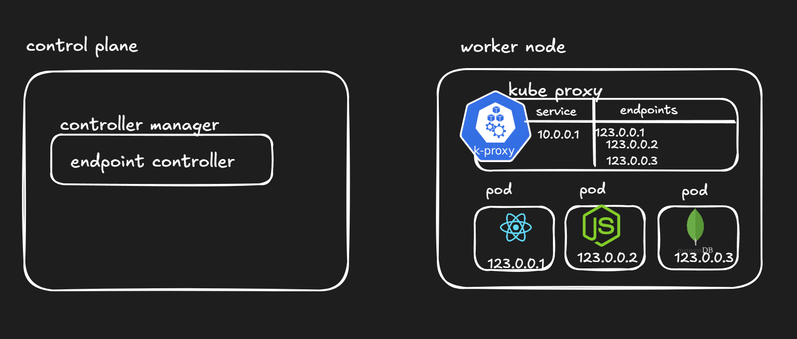

# Services and Networking

## ⭐ Service and Networking in Kubernetes

In Kubernetes, Pods are created and destroyed frequently. Because of this dynamic nature, the IP address of a Pod can change whenever it is recreated. This makes direct communication between Pods unreliable. Kubernetes solves this problem using **Services and networking mechanisms** that provide stable communication between applications inside the cluster and from external users.

A Service acts as a stable network endpoint that allows applications to communicate with a group of Pods without needing to know their individual IP addresses.

---

### ⚡ Pod Networking

Every Pod in a Kubernetes cluster gets its own **unique IP address**. This allows Pods to communicate directly with each other across different nodes in the cluster.

Kubernetes follows a networking model where:

* Every Pod can communicate with any other Pod without Network Address Translation (NAT)
* Pods across nodes can reach each other using their Pod IP addresses
* Containers inside the same Pod share the same network namespace

Because Pods can be recreated at any time, their IP addresses may change. That is why Services are required to provide stable communication.

## ⭐ Endpoints in Kubernetes Services

In Kubernetes, an Endpoint represents the actual network addresses of the Pods that a Service sends traffic to. When a Service is created, Kubernetes automatically keeps track of which Pods match the Service’s label selector and stores their IP addresses in an Endpoint object.

A Service itself does not directly run applications. Instead, it acts as a stable access point that forwards incoming traffic to the Pods. The Endpoint object contains the list of Pod IP addresses and ports that belong to that Service.

---

### ⚡ How Endpoints Work

When a Service is created, Kubernetes looks at the **label selector** defined in the Service configuration. It searches for Pods that have matching labels.

Once matching Pods are found, Kubernetes collects their **IP addresses and ports** and stores them inside the Endpoint resource.

Whenever traffic comes to the Service, Kubernetes forwards that traffic to one of the Pod IP addresses listed in the Endpoint.

---


## ⭐ How Service, Endpoints, and kube-proxy Work Together in a Microservices Application

In a Kubernetes microservices architecture, applications are usually divided into multiple services such as a **frontend (React)**, **backend (Node.js)**, and **database (MongoDB)**. Each of these components typically runs inside its own set of Pods. For example, you may have several Pods running the backend API, several Pods running the frontend application, and a Pod running MongoDB.

Because Pods are created and deleted dynamically, their IP addresses change frequently. To provide stable communication between these components, Kubernetes uses **Services**, **Endpoints**, and **kube-proxy**.

---

### ⚡ Pods for Microservices

In your example application:

* React frontend runs inside one or more Pods
* Node.js backend runs inside one or more Pods
* MongoDB database runs inside a Pod

Each Pod receives its own **unique IP address** in the cluster. However, these IP addresses are temporary because Pods can be recreated at any time.

---

### ⚡ Kubernetes Service

A **Service** provides a stable network endpoint for accessing a group of Pods. Each Service gets a **stable ClusterIP address** that does not change.

For example:

| Service          | Purpose                        |
| ---------------- | ------------------------------ |
| frontend-service | Routes traffic to React Pods   |
| backend-service  | Routes traffic to Node.js Pods |
| mongodb-service  | Routes traffic to MongoDB Pod  |

Applications communicate with the **Service IP**, not directly with Pod IPs.

A Service identifies the correct Pods using **label selectors**.

Example:

```yaml
selector:
  app: backend
```

This means the Service will send traffic only to Pods that have the label `app: backend`.

---

### ⚡ Endpoints

An **Endpoint** is a Kubernetes object that stores the actual **Pod IP addresses** behind a Service.

For example, if the backend Service has three Pods running, the Endpoint object may contain:

| Pod           | IP Address | Port |
| ------------- | ---------- | ---- |
| backend-pod-1 | 10.244.1.5 | 8080 |
| backend-pod-2 | 10.244.1.6 | 8080 |
| backend-pod-3 | 10.244.1.7 | 8080 |

This Endpoint list tells Kubernetes exactly which Pods are serving the application.

---

### ⚡ Endpoint Controller

Inside the **Controller Manager**, there is an **Endpoint Controller**. Its job is to continuously monitor the cluster.

The Endpoint Controller checks:

* Service selectors
* Pod labels
* Pod IP addresses

If a Pod with a matching label is created, the Endpoint Controller automatically adds its IP address to the Endpoint object.

If a Pod is deleted or crashes, the Endpoint Controller removes that Pod’s IP address from the Endpoint list.

This process runs continuously to keep the Endpoint information up to date.

---

### ⚡ kube-proxy

kube-proxy runs on **every worker node**. It watches the API Server for changes related to Services and Endpoints.

kube-proxy maintains a **network routing table** on each node that maps:

| Service IP | Pod IPs                            |
| ---------- | ---------------------------------- |
| 10.96.0.15 | 10.244.1.5, 10.244.1.6, 10.244.1.7 |

When a request arrives at a Service IP address, kube-proxy selects one of the Pod IP addresses from the Endpoint list and forwards the request to that Pod.

kube-proxy also performs **basic load balancing** by distributing requests across multiple Pods.

---

### ⚡ Request Flow in Your Microservices Example

1. A client sends a request to the **frontend Service IP**.
2. kube-proxy receives the request and forwards it to one of the **React Pods**.
3. The React application calls the **backend Service**.
4. kube-proxy routes the request to one of the **Node.js backend Pods**.
5. The backend application connects to the **MongoDB Service**.
6. kube-proxy forwards the request to the **MongoDB Pod**.

---

### ⚡ Automatic Updates When Pods Change

If a Pod is deleted or recreated:

1. The Endpoint Controller detects the change.
2. It updates the Endpoint object by removing or adding Pod IP addresses.
3. kube-proxy updates its routing table.
4. Traffic continues to flow correctly to the remaining Pods.

This automatic update mechanism ensures reliable communication even when Pods are constantly created or deleted.

---


