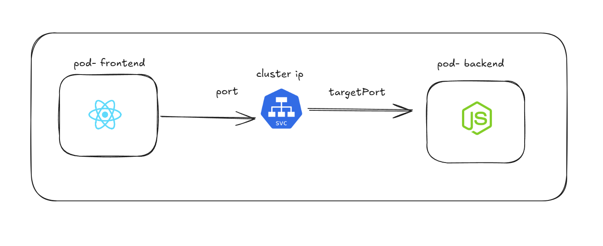
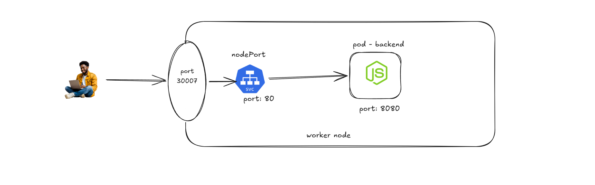
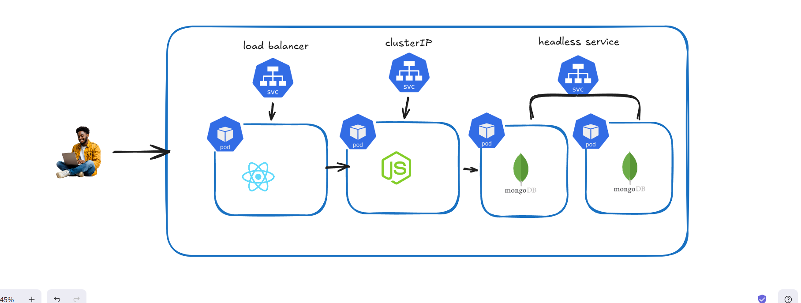
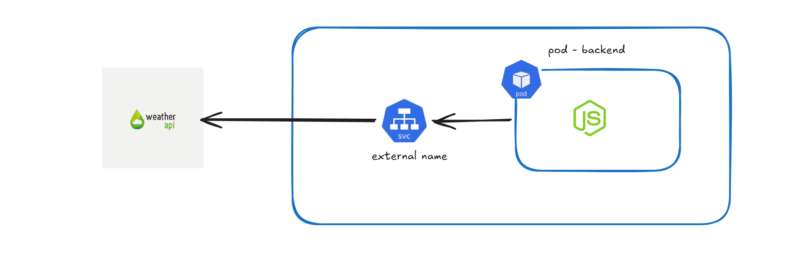

# Types of Services 

## ⭐ Types of Services in Kubernetes

In Kubernetes, a Service provides a stable way to access Pods. Since Pod IP addresses can change when Pods are recreated, Services provide a consistent network endpoint for communication. Kubernetes supports different types of Services depending on how the application needs to be accessed.


### ⚡ ClusterIP

ClusterIP is the default type of Service in Kubernetes. It exposes the Service only inside the Kubernetes cluster. Other Pods within the cluster can communicate with the Service using its ClusterIP address.

This type is commonly used for internal communication between microservices.

#### Example:

* A frontend Pod communicates with a backend Service

* A backend Pod communicates with a database Service

* External users cannot access a ClusterIP Service directly.


```yml
apiVersion: v1
kind: Service
metadata: 
    name: my-service
spec: 
    type: ClusterIP
    selector:   
        app: my-app
    ports:
        - port: 80
          targetPort: 8080
```

```yml
ports:
    - port: 80
      targetPort: 8080
```



### ⚡ NodePort

NodePort exposes the Service on a specific port of each node in the cluster. This allows external users to access the Service using the node’s IP address and the assigned port.

### How NodePort Works

In Kubernetes, Pods have internal IP addresses that are only accessible within the cluster. To allow external access, NodePort exposes the Service on a port of each node.

When a request comes from a client:

* The client sends a request to the Node IP and NodePort.

* The request reaches the node.

* kube-proxy receives the request.

* kube-proxy forwards the request to the Service.

* The Service routes the request to one of the matching Pods.

### NodePort Port Range

Kubernetes automatically assigns a NodePort from a predefined range:

```
30000 – 32767
```

```yml
apiVersion: v1
kind: Service
metadata: 
    name: nodeport-service
spec: 
    type: NodePort
    selector: 
        app: kube-web-app
    ports:
        - port: 80
          targetPort: 8080
          nodePort: 30007
```



### NodePort is commonly used for:

* Testing applications

* Development environments

* Exposing services without cloud load balancers

* This is not a safe approach 

* we are not using in production

---

### ⚡ LoadBalancer

LoadBalancer is used when Kubernetes is running in a cloud environment. When this Service type is created, Kubernetes automatically provisions a cloud load balancer that routes external traffic to the Service.

When a Service with type LoadBalancer is created, Kubernetes communicates with the cloud provider through the Cloud Controller Manager. The cloud provider then automatically creates an external load balancer and connects it to the Kubernetes Service.

This type is commonly used for production applications that need public internet access.

Example:

* AWS Elastic Load Balancer

* Azure Load Balancer

* Google Cloud Load Balancer

---

### ⚡ Headless Service 

A Headless Service in Kubernetes is a type of Service where Kubernetes does not assign a ClusterIP. Instead of providing one virtual IP address and load balancing traffic, it directly exposes the IP addresses of the Pods behind the Service. This allows applications to communicate directly with specific Pods instead of sending requests through a load-balanced Service.

In a normal Kubernetes Service, Kubernetes assigns a ClusterIP and performs load balancing between Pods. When an application sends a request to the Service, Kubernetes automatically forwards the request to one of the available Pods.



#### Problem with Databases

For databases or stateful systems, load balancing can create problems. Many databases run in clusters where different Pods have different roles.

For example:

One Pod may act as the primary database that handles write operations.

Other Pods may act as replica databases that handle read operations.

If a normal Service randomly sends traffic to any database Pod, the backend application may try to write data to a replica database, which can cause errors.

####  How Headless Service Solves This

Headless Service removes the load balancing layer. Instead of returning a single Service IP, Kubernetes returns the IP addresses of all Pods that match the Service selector.

When the backend application queries the Headless Service, it receives the list of database Pod IP addresses. The application can then choose the correct Pod to communicate with.

```yml
# yml file for headless
apiVersion: v1
kind: Service
metadata: 
    name: headless-service
spec:
    type: ClusterIP
    clusterIP: none
    selector: 
        app: my-app
    ports: 
        - port: 80
          targetPort: 8080
``` 

---

### ⚡ External Service in Kubernetes

An External Service in Kubernetes is used when applications inside the cluster need to communicate with services that exist outside the Kubernetes cluster. Instead of creating Pods inside Kubernetes, this type of service connects Kubernetes applications to external systems such as external databases, APIs, or legacy systems.

This allows Pods inside the cluster to access external resources using a Kubernetes Service name, making the connection easier and more consistent.

#### Why External Services Are Used

In many real-world architectures, not every component runs inside Kubernetes. Some systems may already exist outside the cluster.

For example:

* An external database running on a cloud server

* A third-party API service

* A legacy application hosted outside Kubernetes

Instead of hardcoding external IP addresses in applications, Kubernetes allows developers to create an External Service so that applications can access those resources using a Service name.

```yml
# yml file for external name
apiVersion: v1
kind: Service
metadata: 
    name: external-name-service
spec: 
    type: ExternalName
    externalName: api.weather.com
    ports: 
        - port: 80
```


