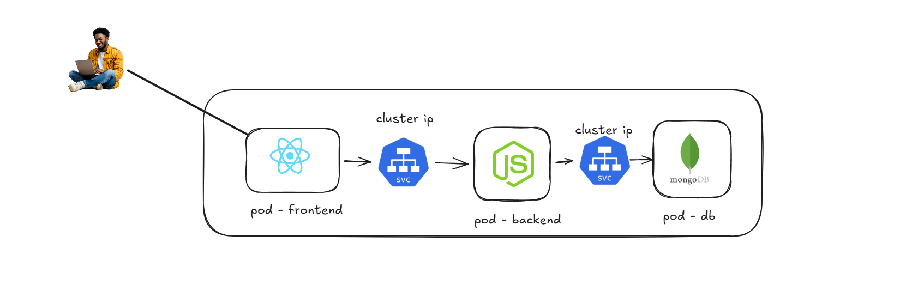

# Types of Services 

## ⭐ Types of Services in Kubernetes

In Kubernetes, a Service provides a stable way to access Pods. Since Pod IP addresses can change when Pods are recreated, Services provide a consistent network endpoint for communication. Kubernetes supports different types of Services depending on how the application needs to be accessed.

### ⚡ ClusterIP

ClusterIP is the default type of Service in Kubernetes. It exposes the Service only inside the Kubernetes cluster. Other Pods within the cluster can communicate with the Service using its ClusterIP address.

This type is commonly used for internal communication between microservices.

#### Example:

* A frontend Pod communicates with a backend Service

* A backend Pod communicates with a database Service

* External users cannot access a ClusterIP Service directly.