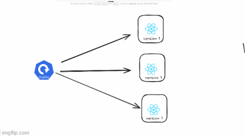

## ⭐ Problem When Updating Application Using ReplicaSet

Suppose you have a calculator application running in Kubernetes with **3 Pods**, and all of them are running **version v1** of the application. Users access the calculator through these Pods, and everything works normally.

| Pod   | Version |
| ----- | ------- |
| pod-1 | v1      |
| pod-2 | v1      |
| pod-3 | v1      |

Now imagine you want to update the application to **version v2**.

---

### ⚡ Updating Using ReplicaSet

If the application is managed using only a **ReplicaSet**, updating the application version is not straightforward. To update the application, you would typically need to delete the existing ReplicaSet that runs version v1 and then create a new ReplicaSet that runs version v2.

The steps would look like this:

* Delete the ReplicaSet running **version v1**
* Create a new ReplicaSet running **version v2**

---

### ⚡ What Happens During This Update

When the ReplicaSet running version v1 is deleted, Kubernetes removes all the Pods created by that ReplicaSet.

| Pod   | Version |
| ----- | ------- |
| pod-1 | Deleted |
| pod-2 | Deleted |
| pod-3 | Deleted |

At this moment, no Pods are running in the cluster.

Because the application is no longer running, users trying to access the calculator will experience **downtime**.

After that, when the new ReplicaSet for version v2 is created, Kubernetes starts new Pods.

| Pod   | Version |
| ----- | ------- |
| pod-1 | v2      |
| pod-2 | v2      |
| pod-3 | v2      |

Once these Pods start running, the application becomes available again.

---

### ⚡ Problem with This Approach

This update process creates a temporary period where the application is not running.

* All old Pods are deleted first
* New Pods are created afterward
* During this time the application is unavailable

This results in **downtime for users**.

---

## ⭐ Deployment in Kubernetes

A Deployment in Kubernetes is a resource used to manage the lifecycle of applications running in Pods. It allows you to define how many Pods should run, which container image should be used, and how updates to the application should be performed.

Instead of directly creating Pods or ReplicaSets, developers usually create a Deployment. The Deployment automatically creates and manages a ReplicaSet, and the ReplicaSet manages the Pods. This layered structure makes application management easier and more reliable.

## ⭐ Rolling Update Strategy in Kubernetes

Rolling Update is a deployment strategy in Kubernetes used to update an application to a new version without stopping the service. Instead of deleting all old Pods and creating new ones at once, Kubernetes gradually replaces the old Pods with new Pods running the updated version. This ensures that the application remains available to users during the update process.

When a new version of an application is deployed, Kubernetes starts creating new Pods with the updated image while slowly terminating the old Pods. Because some Pods remain active throughout the process, users can continue accessing the application without experiencing downtime.

