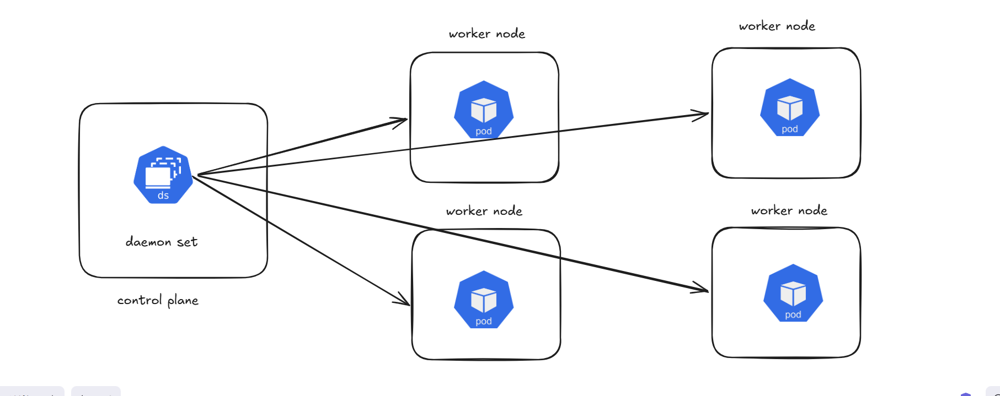

## ⭐ DaemonSet in Kubernetes

A DaemonSet in Kubernetes is used to ensure that a specific Pod runs on every node in the cluster. Instead of specifying the number of replicas like in Deployments or ReplicaSets, a DaemonSet automatically creates one Pod on each worker node.

Whenever a new node is added to the cluster, Kubernetes automatically schedules the DaemonSet Pod on that node. Similarly, if a node is removed from the cluster, the corresponding Pod is also removed.

This ensures that certain system-level applications run consistently across all nodes.



## Use of DaemonSet in Kubernetes

A DaemonSet in Kubernetes is used to ensure that a specific Pod runs on every worker node in the cluster. Its main purpose is to deploy system-level services that must run on all nodes so they can **monitor, manage, or collect information** from those nodes.

Unlike Deployments or ReplicaSets, where you specify the number of replicas, a DaemonSet automatically runs one Pod per node. If a new node is added to the cluster, Kubernetes automatically creates the DaemonSet Pod on that node. If a node is removed, the Pod running on that node is also removed.

This ensures that important background services are always running on every node.

* Log collection from each node

* Monitoring node performance (CPU, memory, disk usage)
* Network management plugins
* Security monitoring agents
 
```yml
apiVersion: apps/v1
kind: DaemonSet
metadata:
  name: node-service-daemonset
  labels: 
    app: node-service-daemonset-label
spec: 
  selector: 
    matchLabels:
      app: kube-web-backend
  template:
    metadata:
      labels:
        app: kube-web-backend
    spec: 
      containers: 
        - name: kube-web-backend
          image: itisameerkhan/kube-web-backend:v3
          ports:
            - containerPort: 8080
```