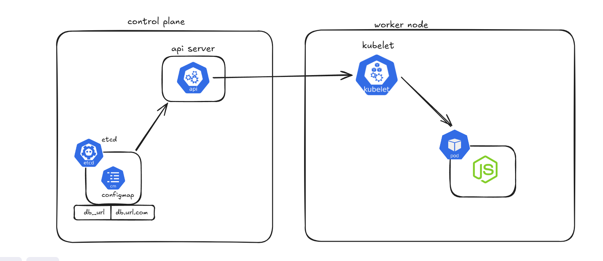

## ⭐ ConfigMap in Kubernetes

A ConfigMap in Kubernetes is used to store configuration data separately from the application code. It allows developers to keep application settings, environment variables, or configuration files outside the container image so that the application can be configured without rebuilding the container.

By using a ConfigMap, the same container image can run in different environments (development, testing, production) with different configuration values.

### ⚡ Why ConfigMap Is Used

Applications often require configuration data such as:

Database URLs

API endpoints

Application settings

Environment variables

Instead of hardcoding these values inside the application or Docker image, Kubernetes stores them in a ConfigMap and provides them to the Pods when they start.



### ⚡ YML for config map 

```yml
apiVersion: v1
kind: ConfigMap
metadata: 
    name: config-map-demo
data: 
    DB_URL: "db.url.com"
    DB_USER: "admin"
    DB_PASSWORD: "password"
```

### ⚡ create configmap from file 

```cmd
kubectl create configmap myconfigmapdemo --from-file=application.yml
```

### ⚡ if we hard coded the env values like 

```yml
apiVersion: v1
kind: ConfigMap
metadata: 
    name: config-map-demo
data: 
    DB_URL: "db.url.com"
    DB_USER: "admin"
    DB_PASSWORD: "password"
```

#### Then use this to attach configmap to pod 

```yml
envFrom: 
    - configMapRef: 
        name: config-map-demo 
```