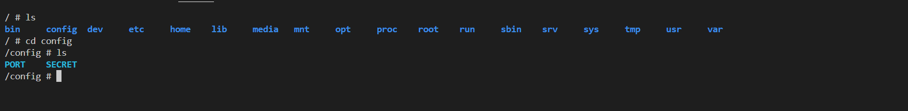
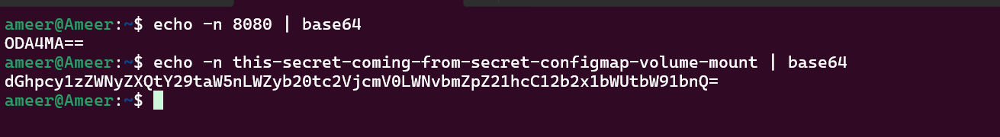

## ⭐ ConfigMap in Kubernetes

A ConfigMap in Kubernetes is used to store configuration data separately from the application code. It allows developers to keep application settings, environment variables, or configuration files outside the container image so that the application can be configured without rebuilding the container.

By using a ConfigMap, the same container image can run in different environments (development, testing, production) with different configuration values.

### ⚡ Why ConfigMap Is Used

Applications often require configuration data such as:

Database URLs

API endpoints

Application settings

Environment variables

Instead of hardcoding these values inside the application or Docker image, Kubernetes stores them in a ConfigMap and provides them to the Pods when they start.


### ⚡ YML for config map 

```yml
apiVersion: v1
kind: ConfigMap
metadata: 
    name: config-map-demo
data: 
    DB_URL: "db.url.com"
    DB_USER: "admin"
    DB_PASSWORD: "password"
```

### ⚡ create configmap from file 

```cmd
kubectl create configmap myconfigmapdemo --from-file=application.yml
```

### ⚡ if we hard coded the env values like 

```yml
apiVersion: v1
kind: ConfigMap
metadata: 
    name: config-map-demo
data: 
    DB_URL: "db.url.com"
    DB_USER: "admin"
    DB_PASSWORD: "password"
```

#### Then use this to attach configmap to pod 

```yml
envFrom: 
    - configMapRef: 
        name: config-map-demo 
```

### ⚡ If we coverted the file into configmap then use this 

```yml
VolumeMounts: 
    - name: myconfigmapdemo
      mountPath: /config
        readOnly: true
        volumes:   
```

### ⚡ Config map 

```yml
apiVersion: v1 
kind: ConfigMap 
metadata:
  name: node-api-configmap 
data: 
  PORT: "8080"
  SECRET: this-is-the-secret-from-kubernetes-configmap
```

```
kubectl apply -f configmap.yml
```


#### check created configmap 

```cmd
kubectl get configmap
```

#### describe the configmap 

```cmd
kubectl describe cm node-api-configmap
```

```
Name:         node-api-configmap
Namespace:    default
Labels:       <none>
Annotations:  <none>

Data
====
PORT:
----
8080

SECRET:
----
this-is-the-secret-from-kubernetes-configmap


BinaryData
====

Events:  <none>
```

### ⚡ `envFrom`

```yml
envFrom: 
    - configMapRef: 
      name: node-api-configmap
```


```yml
apiVersion: apps/v1
kind: Deployment 
metadata:
  name: node-api-deployment
  labels:
    app: node-api-deployment-label
spec: 
  replicas: 3
  strategy:
    type: RollingUpdate
  selector: 
    matchLabels:
      app: node-api 
  template:
    metadata: 
      labels:
        app: node-api 
    spec: 
      containers:
        - name: node-api-container 
          image: itisameerkhan/node-api:v6
          ports: 
            - containerPort: 8080
          envFrom: 
            - configMapRef: 
                name: node-api-configmap

---

apiVersion: v1 
kind: Service 
metadata:
  name: node-api-service 
  labels: 
    app: node-api-service-label
spec: 
  type: NodePort 
  selector: 
    app: node-api 
  ports: 
    - port: 80
      targetPort: 8080 
      nodePort: 30080
```

### ⚡ mount volume the env 

```yml
apiVersion: apps/v1
kind: Deployment
metadata:
  name: node-api-deployment
  labels:
    app: node-api-deployment-label
spec: 
  replicas: 3
  strategy:
    type: RollingUpdate
  selector: 
    matchLabels:
      app: node-api 
  template:
    metadata: 
      labels: 
        app: node-api 
    spec: 
      containers:
        - name: node-api-container 
          image: itisameerkhan/node-api:v6
          ports: 
            - containerPort: 8080
          volumeMounts: 
            - name: node-api-volume 
              mountPath: /config
      volumes: 
        - name: node-api-volume 
          configMap: 
            name: node-api-configmap

--- 

apiVersion: v1 
kind: Service 
metadata:
  name: node-api-service 
  labels: 
    app: node-api-service-label
spec: 
  type: NodePort 
  selector: 
    app: node-api 
  ports: 
    - protocol: TCP 
      port: 80
      targetPort: 8080
      nodePort: 30080
```



---

### ⚡ Creating configmap from file 

```cmd
kubectl create cm configmap-demo-user --from-file=demo.yml
``` 

```yml
# secret.yml
apiVersion: v1 
kind: Secret 
metadata:
  name: node-api-secret 
  labels:
    app: node-api-secret-label 
type: Opaque 
data:   
  PORT: ODA4MA==
  SECRET: dGhpcy1zZWNyZXQtY29taW5nLWZyb20tc2VjcmV0LWNvbmZpZ21hcC12b2x1bWUtbW91bnQ=
```



```
kubectl apply -f secret.yml
```

### ⚡ changes in yml 

```yml
apiVersion: apps/v1
kind: Deployment
metadata:
  name: node-api-deployment
  labels:
    app: node-api-deployment-label
spec:
  replicas: 3
  strategy:
    type: RollingUpdate
  selector:
    matchLabels:
      app: node-api
  template:
    metadata:
      labels:
        app: node-api
    spec:
      containers:
        - name: node-api-container
          image: itisameerkhan/node-api:v6
          ports:
            - containerPort: 8080
          envFrom: 👈
            - secretRef: 
                name: node-api-secret 

---
apiVersion: v1
kind: Service
metadata:
  name: node-api-service
  labels:
    app: node-api-service-label
spec:
  type: NodePort
  selector:
    app: node-api
  ports:
    - port: 80
      targetPort: 8080
      nodePort: 30080
```