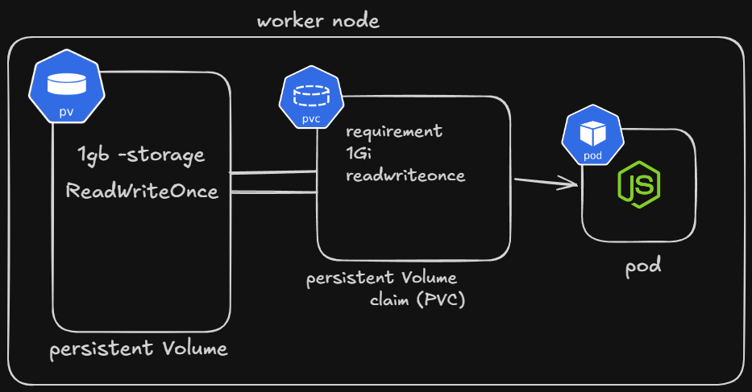

## ⭐ Persistent Volume in Kubernetes

A Persistent Volume (PV) in Kubernetes is a storage resource in the cluster that allows data to persist even if Pods are deleted or recreated. Normally, when a Pod is removed, any data stored inside the container is also lost. Persistent Volumes solve this problem by providing storage that exists independently of the Pod lifecycle.

Persistent Volumes are managed by Kubernetes and can be backed by different types of storage systems such as local disks, network storage, or cloud storage services.

### ⚡ Where Persistent Volume Stores Data in Kubernetes

A Persistent Volume (PV) stores application data in an external storage system or physical disk, not inside Kubernetes itself. Kubernetes only manages the reference to the storage, while the actual files and data are stored in the underlying storage infrastructure.

| Storage Type                  | Where Data is Stored         |
| ----------------------------- | ---------------------------- |
| **Local Persistent Volume**   | Disk of the worker node      |
| **NFS (Network File System)** | External NFS storage server  |
| **AWS EBS**                   | Amazon Elastic Block Storage |
| **Azure Disk**                | Azure managed disk           |
| **Google Persistent Disk**    | Google Cloud storage disk    |
| **Ceph / GlusterFS**          | Distributed storage cluster  |

## ⭐ Types of Persistent Volume Access Modes

| Access Mode | Full Form        | Meaning                                               |
| ----------- | ---------------- | ----------------------------------------------------- |
| RWO         | ReadWriteOnce    | One node can mount the volume as read-write           |
| ROX         | ReadOnlyMany     | Multiple nodes can mount the volume as read-only      |
| RWX         | ReadWriteMany    | Multiple nodes can mount the volume as read-write     |
| RWOP        | ReadWriteOncePod | Only one pod in the entire cluster can use the volume |


## ⭐ Example YML file 

```yml
apiVersion: v1
kind: PersistentVolume
metadata: 
    name: demo-pv
    labels: 
        app: demo-pv-label
spec: 
    capacity: 
        storage: 1Gi
    accessMode: 
        - ReadWriteOnce
    hostPath: 
        path: /data/test 
```


## ⭐ What is a PersistentVolumeClaim (PVC)?

A PersistentVolumeClaim (PVC) is a request made by a Pod for storage in a Kubernetes cluster. Instead of directly using a Persistent Volume (PV), applications request storage through a PVC. Kubernetes then automatically finds a suitable PV and binds it to the PVC.

In simple terms, PVC is like asking Kubernetes for storage, and Kubernetes provides a matching Persistent Volume that satisfies the request.

This abstraction allows developers to request storage without worrying about the underlying storage system (local disk, cloud disk, NFS, etc.).

### ⚡ Example YML for PersistentVolumeClaim (PVC)

```yml
apiVersion: v1
kind: PersistentVolumeClaim
metadata: 
    name: demo-pvc
    labels: 
        app: demo-pvc-label
spec:
    accessMode: 
        - ReadWriteOnce
    resources: 
        requests: 
            storage: 1Gi
```



## ⭐ Question: If PVC Requests 1Gi but Only a 2Gi PV Exists, What Happens?

In Kubernetes, a **PersistentVolumeClaim (PVC)** requests a specific amount of storage. Kubernetes will try to find a **PersistentVolume (PV)** that satisfies the request. The important rule is that the PV must have **equal or greater capacity than the requested storage**.

So if a PVC requests **1Gi** and the only available PV has **2Gi**, Kubernetes **will bind the PVC to that 2Gi PV** because it satisfies the requirement.

However, the PVC will still **request only 1Gi**, even though the underlying PV has more capacity.


### ⚡ Important Kubernetes Rule

| Condition             | Result     |
| --------------------- | ---------- |
| PV size = PVC request | Bind       |
| PV size > PVC request | Bind       |
| PV size < PVC request | No binding |

---

## ⭐ What is a StorageClass in Kubernetes?

A StorageClass in Kubernetes defines how Persistent Volumes (PV) should be created automatically. It provides a way to dynamically provision storage instead of manually creating Persistent Volumes.

Before StorageClass existed, administrators had to manually create PVs and developers would create PVCs to bind to them. With StorageClass, when a PVC requests storage, Kubernetes can automatically create the required PV using the specified storage backend.

In simple terms, StorageClass acts like a storage template or blueprint that tells Kubernetes how to create storage dynamically.


### ⚡ Example YML for StorageClass

```yml
apiVersion: storage.k8s.io/v1
kind: StorageClass
metadata: 
    name: demo-storage-class
spec: 
    provisioner: kubernetes.io/aws-ebs
    parameters: 
        type: gp2
    reclaimPolicy: Delete
```

### ⚡ If you want to delete PV after PVC deleted

```yml
spec: 
    provisioner: kubernetes.io/aws-ebs
    parameters: 
        type: gp2
    reclaimPolicy: Delete 👈
```


### ⚡ If you want PV after PVC deleted

```yml
spec: 
    provisioner: kubernetes.io/aws-ebs
    parameters: 
        type: gp2
    reclaimPolicy: Retain 👈
```

### ⚡ Get the PVC

```
kubectl get pvc
```

### ⚡ Creating a PVC 

```yml
apiVersion: v1
kind: PersistentVolumeClaim
metadata: 
    name: node-api-pvc
    labels:
        app: node-api-pvc-label
spec: 
    accessModes: 
        - ReadWriteOnce
    resources:
        requests:   
            storage: 1Gi
```

```
kubectl apply -f node-api-pvc.yml
``` 

### ⚡ Creating a PV 

```yml
apiVersion: v1
kind: PersistentVolume
metadata: 
    name: node-api-pv
    labels: 
        app: node-api-pv-label
spec: 
    capacity: 
        storage: 1Gi
    accessModes: 
        - ReadWriteOnce 
    persistentVolumeReclaimPolicy: Delete
    hostPath: 
        path: /data/test
```

```
kubectl apply -f node-api-pv.yml
```


---

```
kubectl get pv
```

```
NAME                                       CAPACITY   ACCESS MODES   RECLAIM POLICY   STATUS      CLAIM                  STORAGECLASS   VOLUMEATTRIBUTESCLASS   REASON   AGE
node-api-pv                                1Gi        RWO            Delete           Available                                         <unset>                          5m33s
pvc-f37dcb18-1e65-420c-860f-1aaff58940c5   1Gi        RWO            Delete           Bound       default/node-api-pvc   standard       <unset>                          109s
```
---
```
kubectl get pvc
```

```
NAME           STATUS   VOLUME                                     CAPACITY   ACCESS MODES   STORAGECLASS   VOLUMEATTRIBUTESCLASS   AGE
node-api-pvc   Bound    pvc-f37dcb18-1e65-420c-860f-1aaff58940c5   1Gi        RWO            standard       <unset>                 113s
```

## ⭐ What is a StorageClass in Kubernetes?

A StorageClass in Kubernetes defines how storage should be dynamically created for PersistentVolumeClaims (PVCs). It acts like a template or blueprint for storage provisioning. Instead of manually creating Persistent Volumes (PV), Kubernetes can automatically create them when a PVC requests storage using a StorageClass.

In simple terms, a StorageClass tells Kubernetes what type of storage to create, which provisioner to use, and what policy to apply when storage is needed.

For example, when a developer creates a PVC requesting 1Gi storage, Kubernetes checks the StorageClass and automatically creates a matching Persistent Volume.

```yml
# storage-class.yml
apiVersion: storage.k8s.io/v1
kind: StorageClass 
metadata: 
  name: node-api-sc
  labels: 
    app: node-api-sc-label
provisioner: k8s.io/minikube-hostpath
reclaimPolicy: Delete 
```

```
kubectl apply -f storage-class.yml
```

```yml
#pvc.yml
apiVersion: v1
kind: PersistentVolumeClaim
metadata:
  name: node-api-pvc
  labels: 
    app: node-api-pvc-label 
spec: 
  accessModes:
    - ReadWriteOnce
  storageClassName: node-api-sc 👈
  resources: 
    requests:
      storage: 1Gi
```