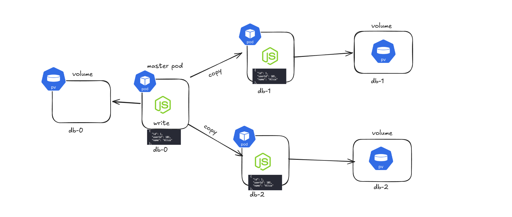

## ⭐ Stateless vs Stateful Applications in Kubernetes (Frontend, Backend, Database)

In Kubernetes, applications are commonly divided into **stateless components** and **stateful components** based on whether they store data internally. Stateless applications do not store user data inside the container, while stateful applications store persistent data that must survive restarts.

In a typical web architecture:

* **Frontend and Backend services are stateless**
* **Databases are stateful**

This design makes scaling and managing applications easier in Kubernetes.

---

### ⚡ Stateless Applications (Frontend & Backend)

Stateless applications **do not store persistent data inside the container**. If a container crashes or restarts, no important data is lost because the application retrieves data from external systems like databases or APIs.

Frontend and backend services usually behave this way.

Examples:

* React frontend
* Node.js backend API
* Express servers
* Microservices

## ⭐ Stateful Applications (Database)

Stateful applications **store persistent data** that must remain available even if the container restarts. Databases are the most common example.

Examples:

* MongoDB
* MySQL
* PostgreSQL
* Redis (sometimes)

If a database pod crashes and the data is lost, the application becomes unusable. That is why Kubernetes uses **Persistent Volumes** to store database data.

## ⭐ What is a StatefulSet in Kubernetes?

A StatefulSet in Kubernetes is used to manage applications that store data and need stable identities, such as databases. Unlike stateless applications where pods can be created or destroyed freely, stateful applications require consistency in their pod name, network identity, and storage. StatefulSet ensures that each pod keeps the same identity and its own persistent storage even if it crashes or is restarted.

For example, if you run a database like MongoDB in Kubernetes using a StatefulSet with three replicas, Kubernetes will create pods with predictable names such as mongodb-0, mongodb-1, and mongodb-2. If the pod mongodb-1 fails, Kubernetes recreates it with the same name and the same storage, so the database data is not lost. This is important for systems that rely on stable identities, such as distributed databases or clustered applications.

## A StatefulSet is commonly used to run database clusters in Kubernetes because databases need persistent storage and stable identities. Consider a database setup with 3 pods: one master database and two replica (slave) databases. The master database handles all write operations, while the replica databases receive copies of the data from the master to keep the cluster synchronized.

When a client application sends a request to store data, the request goes to the master database pod. The master writes the data to its own persistent storage. After writing the data, the master replicates the same data to the replica databases, so all database nodes contain the same information. This process is called database replication.

In Kubernetes, the StatefulSet creates pods with stable names, such as db-0, db-1, and db-2. Typically, the first pod (db-0) acts as the master, and the other two pods (db-1 and db-2) act as replicas. Each of these pods has its own PersistentVolumeClaim, which connects to a Persistent Volume. Because of this, every database instance has its own disk storage.

Each database pod writes its data to its own Persistent Volume. This means that if a pod crashes or is deleted, the data is not lost, because the storage is separate from the container itself. Kubernetes will recreate the pod with the same name, and it will reconnect to the same volume, allowing the database to continue using its previous data.

## ⭐ How a Backend Pod Talks to the Master Database Pod Using DNS in Kubernetes

In Kubernetes, pods communicate with each other using DNS-based service discovery. Instead of using IP addresses (which change when pods restart), Kubernetes assigns stable DNS names to services and StatefulSet pods. This allows applications like backend APIs to reliably connect to database pods.