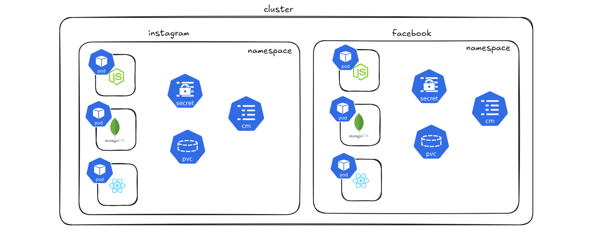

# namespace 

## ⭐ What is a Namespace in Kubernetes?

A Namespace in Kubernetes is a way to logically divide a cluster into multiple virtual environments. It helps organize and isolate resources such as pods, services, deployments, and config maps within the same Kubernetes cluster.

In large systems where many teams or applications share the same cluster, namespaces help prevent conflicts and make management easier. For example, two teams can deploy applications with the same resource name in different namespaces without interfering with each other.

In simple terms, a namespace acts like a folder that groups Kubernetes resources together inside a cluster.



### ⚡ Creating a namespace 

```
kubectl create namespace instagram
```

### ⚡ Get namespace 

```
kubectl get namespace
```

### ⚡ Getting Pods inside namespace 

```
kubectl get pods --namespace=instagram
```

### ⚡ Creating a Pod with namespace

```yml
apiVersion: v1
kind: Pod
metadata: 
  name: node-api
  namespace: instagram
  labels: 
    app: node-api-label
spec: 
  containers: 
    - name: node-api
      image: itisameerkhan/node-api:v6
      ports: 
        - containerPort: 8080
```

### ⚡ Getting Pods inside namespace 

```
kubectl get pods --namespace=instagram
```

```
NAME       READY   STATUS    RESTARTS   AGE
node-api   1/1     Running   0          21s
```

### ⚡ Getting Pods

```
kubectl get pods 
```

```
No resources found in default namespace.    
```

This is because kuberetes getting the pod from default namespace 

```
kubectl get namespace
```

```
NAME              STATUS   AGE
default           Active   5d7h  👈
instagram         Active   10m
kube-node-lease   Active   5d7h
kube-public       Active   5d7h
kube-system       Active   5d7h
```

> [!NOTE]
> not every resources in kubernetes can be added to namespace 